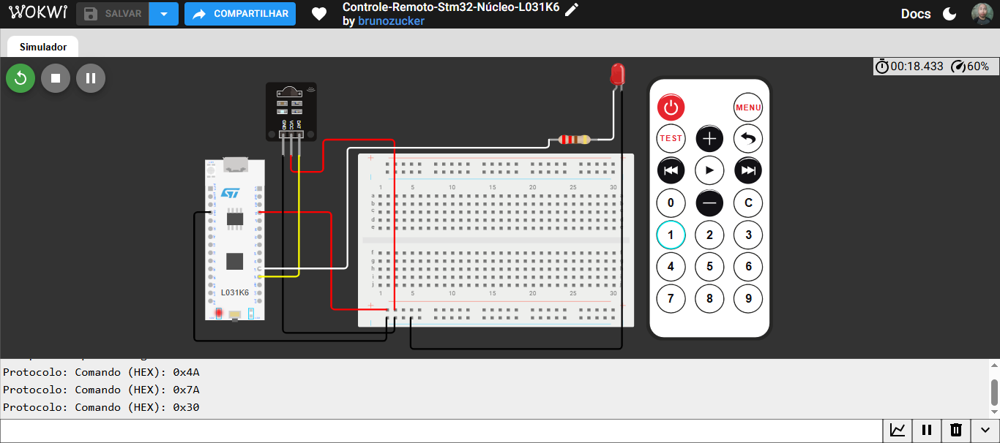

# 📡 Controle-Remoto-Stm32-Núcleo-L031K6

Simulação de um sistema com controle remoto infravermelho, feita com a placa STM32 Nucleo L031K6 no Wokwi.

---

## 📋 Sobre o projeto

A ideia foi receber comandos de um controle remoto infravermelho e mostrar o código de cada tecla no Monitor Serial. Cada vez que o microcontrolador recebe um comando, ele também pisca um LED para indicar que a recepção funcionou.

Esse projeto é a versão para STM32 do meu controle remoto feito originalmente em Arduino Nano. Nesta versão ficou só a parte do infravermelho e do LED, sem o sensor ultrassônico.

O projeto foi feito como parte do meu portfólio prático de sistemas embarcados, usando o Wokwi como ambiente de simulação.

▶️ [Abrir a simulação no Wokwi](https://wokwi.com/projects/476434505943756801)

---

## 🛠 Ferramentas utilizadas

- Wokwi (simulador)
- STM32 Nucleo L031K6
- Protoboard
- Receptor infravermelho (IR)
- Controle remoto IR
- 1 LED vermelho
- 1 resistor de 220 Ω
- Linguagem C++ (API do Arduino)
- Biblioteca IRremote

---

## 🏗 O que foi montado

O circuito tem dois blocos principais:

- **Receptor IR:** alimentado com 5 V e GND pelos trilhos da protoboard, com o sinal de dados ligado ao pino A0 da placa.
- **LED de aviso:** ligado ao pino A1 com um resistor de 220 Ω em série e o outro lado no GND. Ele pisca sempre que um comando é recebido.

O Monitor Serial usa a porta serial virtual (VCP) da própria Nucleo, então não precisa de nenhum componente extra para ver as mensagens.

### Pinagem

| Componente | Pino da STM32 Nucleo L031K6 |
|---|---|
| Receptor IR (DAT) | A0 |
| LED vermelho (via resistor de 220 Ω) | A1 |

---

## 🔧 Como funciona

1. A placa fica aguardando um sinal do receptor infravermelho.
2. Quando uma tecla do controle é pressionada, o código lê o comando e mostra o valor em hexadecimal no Monitor Serial.
3. O LED pisca por 50 ms para indicar que o comando foi recebido.
4. O receptor fica pronto para o próximo comando.

---

## 💻 Código

```cpp
// Controle-Remoto-Stm32-Núcleo-L031K6

#include <IRremote.h>

// Pino Digital A1 onde está o LED
#define PINO_LED A1

// Pino Digital A0 onde está o receptor IR
#define PINO_RECV A0

void setup() {
  Serial.begin(9600);

  // Inicializa o receptor IR no pino especificado
  IrReceiver.begin(PINO_RECV, ENABLE_LED_FEEDBACK);
  Serial.println("Receptor IR pronto. Aguardando comandos do controle...");

  // Define o pino do LED como saída
  pinMode(PINO_LED, OUTPUT);

}

void loop() {
  if (IrReceiver.decode()) {

    // Verifica o protocolo detectado
    if (IrReceiver.decodedIRData.protocol) {
      Serial.print("Protocolo: ");
      Serial.print("Comando (HEX): 0x");
      Serial.println(IrReceiver.decodedIRData.command, HEX);
    } else {

      // Exibe outros protocolos caso o controle genérico do Wokwi envie algo diferente
      Serial.print("Outro protocolo - HEX: 0x");
      Serial.println(IrReceiver.decodedIRData.command, HEX);
    }
   
    // Pisca o LED para indicar recepção
    digitalWrite(PINO_LED, HIGH);
    delay(50);
    digitalWrite(PINO_LED, LOW);

    // Prepara o receptor para receber o próximo sinal
    IrReceiver.resume();
  }
}
```

---

## 📸 Evidências do funcionamento

### Circuito montado e Monitor Serial
A imagem mostra a placa STM32 Nucleo L031K6, o receptor IR, o controle remoto, o LED e o resistor, com o Monitor Serial exibindo os comandos recebidos.



---

## 📁 Arquivo do diagrama

O arquivo `diagram.json` com todas as peças e conexões está disponível no repositório e pode ser importado direto no Wokwi. Lembre de adicionar a biblioteca **IRremote** no projeto.

[📥 Download — diagram.json](diagram.json)

---

## 💡 O que aprendi com esse projeto

O principal foi ver como o mesmo código funciona em uma placa totalmente diferente. O programa do Nano foi reaproveitado quase inteiro, e o que mudou foram os nomes dos pinos (A0 e A1 na Nucleo) e a retirada da parte do sensor ultrassônico.

Também aprendi que a Nucleo tem uma porta serial virtual ligada ao USB da própria placa, o que facilita ver as mensagens no Monitor Serial sem precisar de conversor externo.

Outro ponto é que a STM32 L031K6 trabalha com 3,3 V nos pinos, enquanto o Nano usa 5 V. Isso precisa ser considerado ao escolher como alimentar o receptor e quais componentes ligar nos pinos.

---

## ⚠️ Sobre o projeto

Essa simulação é uma base para estudo. O código ainda não associa cada tecla a uma ação diferente, ele apenas mostra o comando recebido e pisca o LED. Uma evolução natural seria fazer cada botão acionar uma função.

Numa montagem física, vale conferir a tensão do sinal que o receptor entrega ao pino A0. Como a placa trabalha com 3,3 V, o mais seguro é alimentar o receptor com 3,3 V em vez de 5 V, como foi feito na simulação.

---

## 🚀 Próximos projetos

Outros projetos de sistemas embarcados serão postados em breve, com níveis de complexidade maiores.

---

## 👤 Autor: Bruno Zucker
